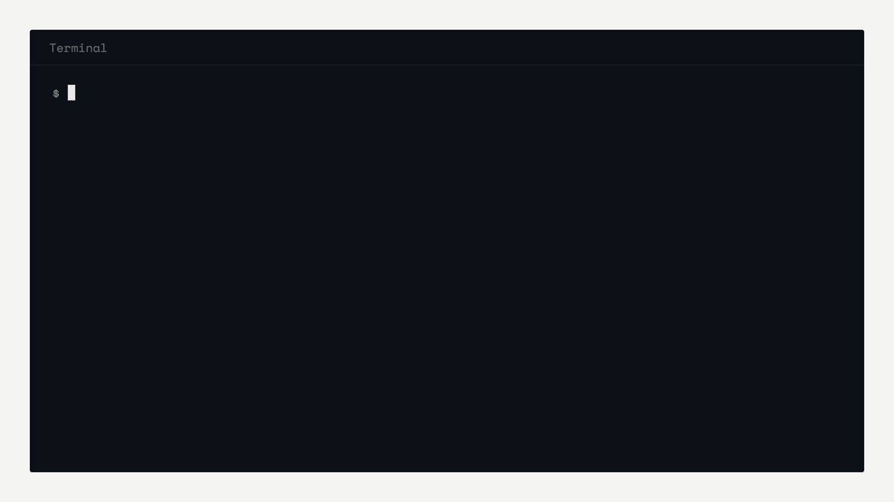

# dpp-lint

[](https://www.npmjs.com/package/dpp-lint)
[](https://github.com/Pangea-Intelligence/dpp-lint/actions/workflows/ci.yml)
[](LICENSE)

Lint EU battery passport payloads and screen raw material origins for due-diligence risk - locally, in seconds, from your terminal.



From 2027-02-18 the EU Battery Regulation (EU 2023/1542) makes a digital battery passport mandatory for LMT, industrial (> 2 kWh) and EV batteries placed on the EU market, and from 2027-08-18 the raw material due-diligence duties of Art. 48-52 apply. The open tooling that exists today is either a heavyweight dataspace stack or a bare schema repository with no developer workflow. dpp-lint is the missing lightweight tool: a single CLI that validates passport payloads against the official DIN DKE SPEC 99100 / Battery Pass data model and screens declared material origins against open risk data. Everything runs locally - your passport data never leaves your machine.

## Quickstart

```sh
# Validate one or more passport payload files
npx dpp-lint lint payload.json

# Screen raw material origins for due-diligence risk
npx dpp-lint risk payload.json --origins origins.json
```

Example output for a payload with two mistakes:

```
$ npx dpp-lint lint payload.json

dpp-lint 0.4.0 - by Pangea Intelligence

FAIL  payload.json (MaterialComposition) - 2 findings
  /batteryChemistry  required attribute "batteryChemistry" is missing
      product chemistry - DIN DKE SPEC 99100 ch. 6.5.2
  /batteryMaterials/0/batteryMaterialMass  expected type number, got string
      weight

1 file checked, 0 passed, 1 failed
```

Want a realistic end-to-end scenario? [`examples/brandt-foerdertechnik/`](examples/brandt-foerdertechnik/) walks through a fictional mid-market machine builder checking the passport files its battery supplier delivered - including the four mistakes hidden in them.

Exit codes: `0` = clean, `1` = findings, `2` = usage or internal error. For `risk`, info-level notes alone do not flip the exit code; only high or medium findings return `1`. For `lint`, an ambiguous module auto-detection counts as a usage error (`2`), because the fix is to pass `--module`; `risk` treats ambiguous payloads conservatively and keeps its findings instead. This makes dpp-lint straightforward to wire into CI pipelines and pre-commit hooks.

## Commands

### `dpp-lint lint <files...>`

Validates one or more battery passport payload files (JSON, UTF-8 or UTF-16) against the official JSON Schemas of the Battery Pass data model (the technical basis of DIN DKE SPEC 99100). The module is auto-detected per file; use `--module` to force one.

Modules covered - the complete set of the Battery Pass data model (names are the official 1.2.0 aspect names):

- `GeneralProductInformation` - product and manufacturer identification, battery category, weight, status
- `MaterialComposition` - battery chemistry, critical raw materials, hazardous substances
- `SupplyChainDueDiligence` - due-diligence report references and third-party assurance
- `CarbonFootprintForBatteries` - lifecycle carbon footprint, per-lifecycle-stage shares, performance class, link to the public carbon footprint study
- `Circularity` - dismantling and removal information, spare part sources, recycled and renewable content, safety measures, end-of-life information
- `PerformanceAndDurability` - technical properties (capacity, power, resistance, cycle life) and battery condition
- `Labeling` - declaration of conformity, test reports, labels and markings

The schemas are the official JSON Schema draft-04 artifacts vendored from [batterypass/BatteryPassDataModel](https://github.com/batterypass/BatteryPassDataModel) (CC-BY-4.0). Any fixes applied to the vendored copies are documented in `schemas/PATCHES.md`.

Options:

| Option | Description |
| --- | --- |
| `-m, --module <name>` | Force a specific module instead of auto-detection |
| `-p, --profile <name>` | Passport profile (default: `battery`) |
| `--json` | Machine-readable JSON output |
| `--report <file>` | Additionally write a self-contained HTML report (traffic light, findings table, DIN references) - the document to forward to a supplier or file for an audit |
| `-q, --quiet` | Only report errors, no banner or summary |

### `dpp-lint risk <file> [--origins <file>]`

Screens declared raw material origins for due-diligence risk under EU 2023/1542, Art. 48-52:

- **CAHRA screening** - flags origin countries on the EU indicative list of Conflict-Affected and High-Risk Areas
- **RMI facility check** - matches declared smelters and refiners against the Responsible Minerals Initiative public facility lists
- **Regulated-material gap analysis** - checks coverage of the regulated battery raw materials (cobalt, natural graphite, lithium, nickel) along the OECD five-step due-diligence framework

The screening runs against bundled open data snapshots; sources, versions and licenses are documented in `data/SOURCES.md`.

Options:

| Option | Description |
| --- | --- |
| `-o, --origins <file>` | Material origins file (JSON or CSV, see below) |
| `--json` | Machine-readable JSON output |
| `--report <file>` | Additionally write a self-contained HTML report grouped by OECD step, with severities and data provenance |
| `-q, --quiet` | Only report findings, no banner or summary |

### `dpp-lint template <module>`

Writes a starter payload for a module (the official example values, curated
to validate cleanly) and prints the required fields with their DIN DKE SPEC
99100 chapter references - the fill-in guide when you start from scratch:

```sh
npx dpp-lint template MaterialComposition -o my-battery-materials.json
```

Options: `-o, --output <file>` (default: `<Module>.json` in the current
directory), `-f, --force` to overwrite an existing file.

## CI integration (GitHub Action)

The repository doubles as a GitHub Action, so passport payloads can be
checked on every push or pull request with three lines:

```yaml
- uses: Pangea-Intelligence/dpp-lint@v0.4.0
  with:
    files: passports/*.json
```

Inputs: `command` (`lint` | `risk`, default `lint`), `files` (required),
`origins` (for `risk`), `module`, `version` (npm version to run, default
`latest`) and `args` for anything else (e.g. `--json`). The job fails when
dpp-lint returns findings, exactly like the CLI exit codes.

Security note: the action passes all inputs to its shell step as
environment variables, so input content cannot execute shell code. The
`args` and `files` inputs are deliberately word-split (globs in `files`
are expanded by bash), which means their content becomes extra CLI
arguments. Use only trusted, static values for these two inputs; never
feed them from untrusted data such as PR titles, branch names or issue
text, or that data could inject additional dpp-lint flags.

## Origins file format

The `risk` command accepts a separate origins file describing where the regulated raw materials come from. JSON and CSV are supported. Both carry the same information, but the field layout differs: JSON uses camelCase fields with a nested `smelter` object, CSV uses flat snake_case columns. Working examples ship in `fixtures/origins.sample.json` and `fixtures/origins.sample.csv`.

### JSON

A top-level object with a `materials` array. Fields per entry:

| Field | Required | Description |
| --- | --- | --- |
| `material` | yes | Raw material name, e.g. `cobalt`, `natural graphite`, `lithium`, `nickel` (synonyms and CAS numbers are also recognized) |
| `originCountry` | yes | Country of origin (ISO 3166-1 alpha-2 code) |
| `share` | no | Share of this origin for the material (0 to 1) |
| `smelter` | no | Smelter or refiner object; needs at least a `name` or an `id` |
| `smelter.name` | see above | Name of the smelter or refiner |
| `smelter.id` | see above | Facility identifier (e.g. RMI CID) |
| `smelter.country` | no | Country of the smelter or refiner (ISO 3166-1 alpha-2 code) |

```json
{
  "materials": [
    {
      "material": "cobalt",
      "originCountry": "CD",
      "share": 0.6,
      "smelter": {
        "name": "Example Refining Co.",
        "id": "CID000123",
        "country": "FI"
      }
    }
  ]
}
```

### CSV

A header row is required; `material` and `origin_country` must be present, the other columns may be left empty:

```csv
material,origin_country,share,smelter_name,smelter_id,smelter_country
cobalt,CD,0.6,Example Refining Co.,CID000123,FI
```

## Regulatory timeline

| Date | Milestone |
| --- | --- |
| 2026-07-26 | European Commission guidelines on battery due diligence expected |
| 2027-02-18 | Battery passport mandatory for LMT, industrial (> 2 kWh) and EV batteries (EU 2023/1542) |
| 2027-08-18 | Battery due-diligence duties apply (Art. 48-52) |

## Roadmap

- Deeper risk data: IPIS mine-level data, USGS production concentration
- Catena-X and UNTP passport profiles
- Further ESPR product groups beyond batteries

## By Pangea Intelligence

dpp-lint is built and maintained by [Pangea Intelligence](https://pangea-intelligence.eu). dpp-lint gives you a point-in-time check; Pangea provides continuous supply chain risk monitoring where that is not enough.

## License

The tool is licensed under [Apache-2.0](LICENSE). The vendored Battery Pass data model artifacts (schemas and example payloads) are licensed CC-BY-4.0 by the Battery Pass Consortium, and the bundled data snapshots keep their respective open licenses. See [NOTICE](NOTICE) for attributions.
